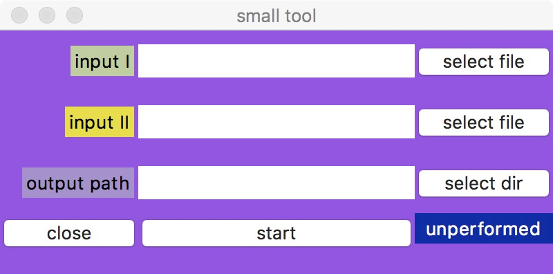

# Base GUI

A wrapper for Tkinter, it's very simple and helpful to equip your backend program with GUI.

# How to use

- modify the config.py to specify the input type and number, here I call it `data row`

```python
INPUT_ROW = {
    'count': 3,
    'row': [
        {'label': 'input I', 'last_label': 'select file', 'type': 'FILE'},
        {'label': 'input II', 'last_label': 'select file', 'type': 'FILE'},
        {'label': 'output path', 'last_label': 'select dir', 'type': 'FILE'},
    ]
}
```

- inherit base_gui.BaseWindow, and instantiate its abstract methods, button callbacks mainly
- create app and run it
- the above configuration will generate the window like


